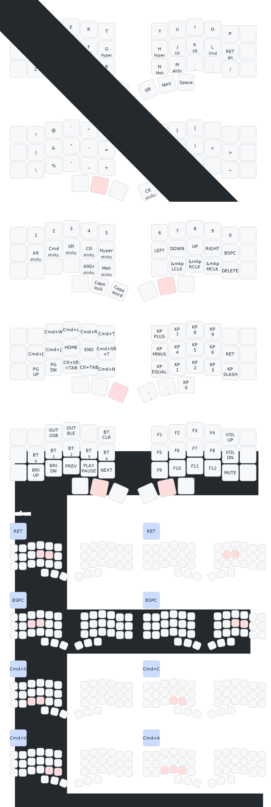

# ZMK config for beekeeb Toucan Keyboard

[The beekeeb Toucan Keyboard](https://beekeeb.com/toucan-keyboard/) is a wireless split 42-key column‑stagger keyboard that a display and a trackpad, with an aggressive stagger on the pinky columns.

## Keymap

# License

The code in this repo is available under the MIT license.

The included shield nice_view_gem is modified from https://github.com/M165437/nice-view-gem licensed under the MIT License.

ZMK code snippets are taken from the ZMK documentation under the MIT license.

The embedded font QuinqueFive is designed by GGBotNet, licensed under under the SIL Open Font License, Version 1.1.
